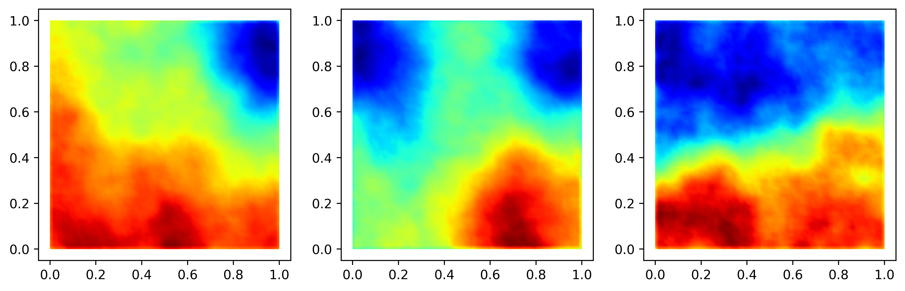

# scikit-gm

This package contains an implementation for a representation of an
infinite-dimensional Gaussian measure. Built on top of the 
FEM library [scikit-fem](https://scikit-fem.readthedocs.io/).



## Installation
In the file ``scikit-gm.py``, we provide the class with the below signature.
Rather than bother with package managers and the like, it's probably easier for
all parties if you simply include this source into your application. The
dependencies match those of ``scikit-fem``.

```python
class Bilaplacian:
    def __init__(
        self,
        V: Basis,
        gamma: float,
        delta: float,
        Theta: np.ndarray | None = None,
        mean: np.ndarray | None = None,
        robin_bc: bool = False,
        seed=None,
    ):
        r"""
        Create an infinite-dimensional Gaussian measure with bi-Laplacian covariance
        operator. That is, covariance given by the operator $C = (\delta I + \gamma
        {\rm div} \Theta \nabla)^{-2}$.

        Parameters
        ----------
        V: Basis
            Finite element discritization of the space
        gamma: float
            Covariance parameter
        delta: float
            Covariance parameter
        Theta: np.ndarray | None
            SPD tensor controlling anistrophic diffusion.
        mean : ArrayLike, default: ``0``
            Mean of the distribution.
        robin_bc: bool
            Whether to employ a Robin boundary condition to minimize boundary artifacts.
        seed : {None, int, `numpy.random.Generator`, `numpy.random.RandomState`}, optional
            If `seed` is None (or `np.random`), the `numpy.random.RandomState`
            singleton is used.
            If `seed` is an int, a new ``RandomState`` instance is used,
            seeded with `seed`.
            If `seed` is already a ``Generator`` or ``RandomState`` instance
            then that instance is used.

        Attributes
        ----------
        V: Basis
            Finite element discritization of the space
        mean : ArrayLike, default: ``0``
            Mean of the distribution.
        R: spsla.LinearOperator
            Operator for the underlying covariance matrix.
        Rinv: spsla.LinearOperator
            Operator for the underlying precision matrix
        A: sp.sparse.sparray
            Discretization of bi-Laplacian operator
        Ainv: spsla.LinearOperator
            Facotrized linear operator representing $A^{-1}$.
        M: sp.sparse.sparray
            Discretization of underling mass matrix
        Minv: sp.sparse.sparray | spsla.LinearOperator
            Operator representing $M^{-1}$.
        sqrtM: sp.sparse.sparray | np.ndarray
            Matrix square root of M
        sqrtMinv: sp.sparse.sparray | spsla.LinearOperator
            Inverse for matrix square root of M
        random_state : `numpy.random.RandomState`
            Internal rng of the class

        Methods
        -------
        logpdf(x)
            Evaluate $||x-x_0||_{R^{-1}}$ where $x_0$ is the mean.
        grad_logpdf(x)
            Evaluate $R^{-1} (x-x_0)$ where $x_0$ is the mean.
        rvs(size=1)
            Sample ``size`` samples from the measure.
        trace(method="exact")
            Compute the trace of the covariance operator. Estimator method also
            avaliable for performance concerns.
        """
```
